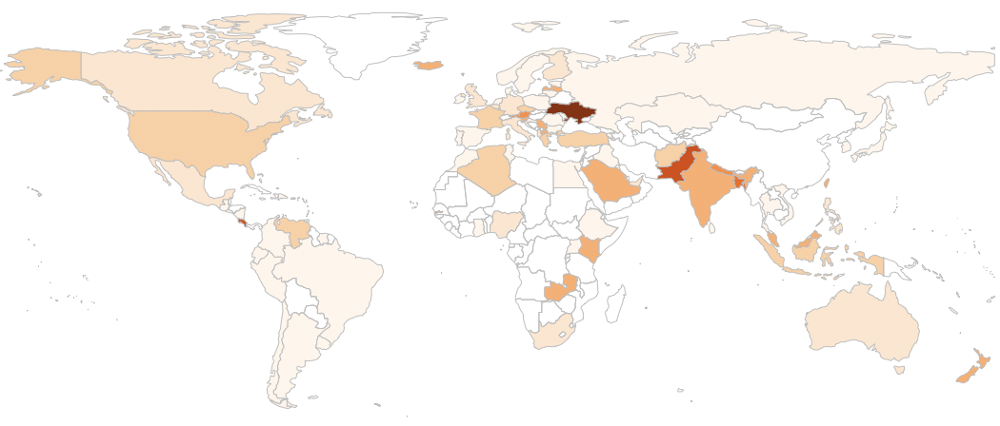

# Applied Data Science @ Columbia
## Spring 2019
## Project 1: What made you happy today?



### [Project Description](doc/Proj1_desc.md)
This is the first and only *individual* (as opposed to *team*) this semester. 

Term: Spring 2019

+ Project title: What makes people garrulous about their happiness?
+ This project is conducted by Elena Dubova

+ Project summary: Happy DB is a huge collection of happy moments by different people all over the world. While the natural first thing to learn about the database is common features and popular topics, I am yet more curious about differences. Happiness is such an abstract notion, so the variability of perceptions is a rich field to explore. In this particlular project I ask a question: what fuels people to say more about their happy moments and go far beyond a standard sentence in description. There is almost a thousand observations over 5 sentences, one description contains as many as 69 sentences! The project consists of two major parts. Firstly, I do exploratory data analysis of demographic data using the length of descriptions as a variable in question. Secondly, I apply text mining techniques to shed light on topics by garrulous and taciturn people.

Following [suggestions](http://nicercode.github.io/blog/2013-04-05-projects/) by [RICH FITZJOHN](http://nicercode.github.io/about/#Team) (@richfitz). This folder is orgarnized as follows.

```
proj/
├── lib/
├── data/
├── doc/
├── figs/
└── output/
```

Please see each subfolder for a README file.
